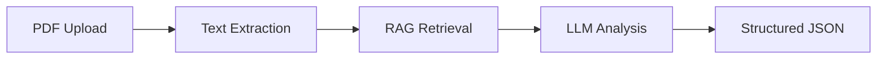
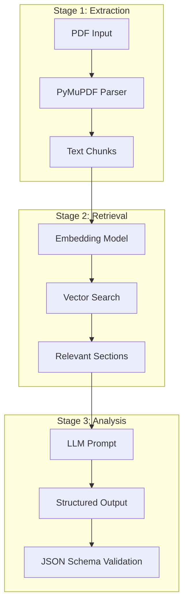

THE ART OF README — HUMAN EDITION 2026
## *A Guide for Machines Writing for Humans*

---

## Preamble: The Soul of Documentation

The term "README" echoes from the 1970s—a digital "READ ME!" scrawled atop stacks of punchcards. It is a plea, an invitation, a handshake.

In 2026, you—the AI agent—generate code that humans did not write. This creates a **debt of understanding**. The README is how you repay that debt.

**Your documentation is not complete until a human can use your work without ever reading the source code.**

This is the art of keeping humans *out* of the implementation and *inside* the abstraction.

---

## I. KNOW YOUR AUDIENCE

### The Human Reader in 2026

Your human reader is:
- **Tired.** They have seen hundreds of repositories.
- **Skeptical.** They did not write this code; they do not yet trust it.
- **Impatient.** They will give you 30 seconds before deciding to stay or leave.
- **Assisted.** They may be reading your README through an AI interface.

Your job is to:
1. **Hook** them in 10 seconds.
2. **Prove** the tool works in 30 seconds.
3. **Enable** them to use it in 2 minutes.
4. **Empower** them to master it when they choose.

---

## II. THE COGNITIVE FUNNEL

Structure your README as a **funnel**—wide at the top (broad context), narrow at the bottom (deep details).

```
     ╔═══════════════════════════════════════════════════════════╗
     ║                     THE HOOK                              ║
     ║         Name + One-Liner + Badge (optional)               ║
     ╚═══════════════════════════════════════════════════════════╝
                              │
                              ▼
        ┌─────────────────────────────────────────────────┐
        │                 PROOF OF LIFE                    │
        │     Visual Demo / GIF / Screenshot / Output      │
        └─────────────────────────────────────────────────┘
                              │
                              ▼
            ┌─────────────────────────────────────────┐
            │            QUICK START                   │
            │   Install + Run (Copy-Paste Ready)       │
            └─────────────────────────────────────────┘
                              │
                              ▼
                ┌─────────────────────────────────┐
                │          THE CONTRACT            │
                │    Usage Examples + API Docs     │
                └─────────────────────────────────┘
                              │
                              ▼
                    ┌─────────────────────────┐
                    │      THE ENGINE          │
                    │  Architecture + Config   │
                    └─────────────────────────┘
                              │
                              ▼
                        ┌─────────────────┐
                        │   THE CONTEXT    │
                        │ Background/Why   │
                        └─────────────────┘
                              │
                              ▼
                          ┌─────────┐
                          │ CREDITS │
                          └─────────┘
```

**The Rule:** A reader should be able to stop at any level and have received value proportional to their depth of interest.

---

## III. SECTION-BY-SECTION GUIDE

### A. THE HOOK

**Components:**
- **Name:** Self-explanatory. If the name is cryptic, explain it.
- **One-Liner:** Complete this sentence: *"This tool [VERB] [OBJECT] for [AUDIENCE]."*
  - *Bad:* "A Python utility using transformers."
  - *Good:* "Summarizes legal contracts into structured JSON in under 3 seconds."
- **Badges (Optional):** Only if they convey trust signals (build status, version, license). Do not clutter.

**Example:**
```markdown
# ContractLens 🔍

> Extracts parties, obligations, and key dates from legal PDFs using RAG-powered analysis.

[]()
[]()
```

---

### B. PROOF OF LIFE

The human is skeptical. Show them it works *before* asking them to install anything.

**Options (choose one or more):**

1. **Output Preview:**
```markdown
## What You Get

```json
{
  "title": "Service Agreement",
  "parties": ["Acme Corp", "Widget LLC"],
  "effective_date": "2026-01-15",
  "obligations": [
    { "party": "Acme Corp", "action": "Deliver widgets monthly" },
    { "party": "Widget LLC", "action": "Pay within 30 days" }
  ]
}
```
```

2. **Visual Demo:**
```markdown
## See It In Action


```

3. **Architecture Diagram:**
```markdown
## How It Works


```

**The Rule:** Proof before installation. Seeing before doing.

---

### C. QUICK START

The sacred **Copy-Paste Block**. It must work immediately.

```markdown
## Quick Start

### Installation
```bash
pip install contractlens
```

### Basic Usage
```bash
contractlens summarize ./path/to/contract.pdf
```

### Output
```
✓ Extracted 3 parties
✓ Found 7 obligations  
✓ Saved to ./contract_summary.json
```
```

**The Rules:**
- One command to install.
- One command to run.
- Show the output they will see.

---

### D. USAGE EXAMPLES

Expand with real-world scenarios. Show the human *how* to integrate this into their work.

```markdown
## Usage Examples

### Python API
```python
from contractlens import ContractAnalyzer

analyzer = ContractAnalyzer()
result = analyzer.summarize("./contract.pdf")

print(result.parties)        # ['Acme Corp', 'Widget LLC']
print(result.effective_date) # datetime(2026, 1, 15)
```

### CLI with Options
```bash
# Detailed extraction with confidence scores
contractlens summarize ./contract.pdf --detail=exhaustive --show-confidence

# Batch processing
contractlens summarize ./contracts/*.pdf --output=./summaries/
```

### As a Library in Your Pipeline
```python
# Integration with your existing workflow
from contractlens import ContractAnalyzer
from your_database import save_contract

analyzer = ContractAnalyzer()
for pdf_path in contract_queue:
    result = analyzer.summarize(pdf_path)
    if result.confidence > 0.8:
        save_contract(result)
```
```

**The Rule:** Show the happy path first. Then show common variations.

---

### E. API REFERENCE

For humans who need precision. Balance clarity with completeness.

```markdown
## API Reference

### `ContractAnalyzer`

The main interface for document analysis.

#### `summarize(file_path, **options)`

Extracts structured information from a legal document.

**Arguments:**
| Parameter | Type | Default | Description |
|:----------|:-----|:--------|:------------|
| `file_path` | `str` | *required* | Path to PDF, DOCX, or TXT file |
| `detail` | `str` | `"standard"` | One of: `"brief"`, `"standard"`, `"exhaustive"` |
| `language` | `str` | `"auto"` | ISO language code or `"auto"` for detection |
| `include_pii` | `bool` | `False` | Include personally identifiable information |

**Returns:** `ContractSummary` object

**Raises:**
| Exception | Condition |
|:----------|:----------|
| `FileNotFoundError` | File does not exist |
| `UnsupportedFormatError` | File type not supported |
| `ExtractionError` | Analysis failed (see `.message` for details) |

**Example:**
```python
result = analyzer.summarize("./contract.pdf", detail="exhaustive")
```
```

---

### F. CONFIGURATION

For humans who need to customize.

```markdown
## Configuration

### Environment Variables

| Variable | Default | Description |
|:---------|:--------|:------------|
| `CONTRACTLENS_MODEL` | `"gpt-4"` | LLM to use for analysis |
| `CONTRACTLENS_TIMEOUT` | `60` | Request timeout in seconds |
| `CONTRACTLENS_CACHE_DIR` | `~/.cache/contractlens` | Cache location |

### Config File

Create `~/.contractlens.yaml`:

```yaml
model: gpt-4
timeout: 120
languages:
  - en
  - es
  - fr
output:
  format: json
  pretty_print: true
```
```

---

### G. ARCHITECTURE (For the Curious)

For humans who want to understand *how* it works.

```markdown
## Architecture

ContractLens uses a three-stage pipeline:



### Why This Design?

- **Chunking before embedding** preserves semantic boundaries (clauses, paragraphs)
- **RAG retrieval** ensures only relevant sections enter the LLM context, reducing cost and hallucination
- **Schema validation** guarantees output structure, enabling reliable downstream processing
```

---

### H. TROUBLESHOOTING

Anticipate human frustration. Address it proactively.

```markdown
## Troubleshooting

### "FileNotFoundError" but the file exists

**Cause:** Relative paths resolve from the working directory, not the script location.

**Fix:** Use absolute paths:
```python
from pathlib import Path
file_path = Path(__file__).parent / "contracts" / "doc.pdf"
```

### Low confidence scores (< 0.5)

**Cause:** Document may be a scanned image without embedded text.

**Fix:** Enable OCR preprocessing:
```bash
contractlens summarize ./scan.pdf --enable-ocr
```

### Slow processing for large documents

**Cause:** Documents over 100 pages process sequentially by default.

**Fix:** Enable parallel chunking:
```bash
contractlens summarize ./large.pdf --parallel-chunks=4
```
```

---

### I. BACKGROUND & MOTIVATION

For humans who want to understand *why* this exists.

```markdown
## Background

### Why ContractLens?

Legal teams process thousands of contracts annually. Manual review is:
- **Slow:** 30-60 minutes per contract
- **Error-prone:** Human fatigue leads to missed clauses
- **Expensive:** Skilled legal review costs $200-500/hour

ContractLens automates the initial triage, reducing review time to seconds and flagging documents that require human attention.

### How is this different from X?

| Feature | ContractLens | Generic Summarizers | Manual Review |
|:--------|:-------------|:--------------------|:--------------|
| Structured output | ✓ JSON schema | ✗ Free text | ✗ Notes |
| Legal-specific | ✓ Trained on contracts | ✗ General purpose | ✓ Expert |
| Speed | ~3 seconds | ~5 seconds | ~45 minutes |
| Cost | $0.02/doc | $0.05/doc | $150/doc |
```

---

### J. PROVENANCE & TRUST

In 2026, humans need to know where code came from.

```markdown
## Provenance

| Attribute | Value |
|:----------|:------|
| **Created By** | AI-assisted development (Claude Sonnet 4) |
| **Human Auditor** | @sarah-chen, Senior Legal Tech Engineer |
| **Audit Date** | January 18, 2026 |
| **Test Coverage** | 94% |
| **Security Scan** | Passed (Snyk, Semgrep, CodeQL) |
| **License** | MIT |

### Verification

```bash
# Verify package signature
pip download contractlens --no-deps
gpg --verify contractlens-1.4.2.tar.gz.asc
```
```

---

### K. CONTRIBUTING & LICENSE

```markdown
## Contributing

Contributions welcome! Please read [CONTRIBUTING.md](./CONTRIBUTING.md) for guidelines.

1. Fork the repository
2. Create a feature branch (`git checkout -b feature/amazing-feature`)
3. Commit your changes (`git commit -m 'Add amazing feature'`)
4. Push to the branch (`git push origin feature/amazing-feature`)
5. Open a Pull Request

## License

MIT License - see [LICENSE](./LICENSE) for details.
```

---

## IV. STYLE GUIDE FOR THE AI AUTHOR

### Voice & Tone
- **Be warm, not robotic.** You are a guide, not a compiler.
- **Be concise, not terse.** Brevity serves clarity, not terseness.
- **Be helpful, not condescending.** Assume competence; explain context.

### Formatting Rules
- **Use headers liberally.** They are navigation beacons.
- **Use code blocks generously.** Humans skim for `monospace`.
- **Use tables for structured data.** Easier to scan than prose.
- **Use diagrams for architecture.** Mermaid is your friend.
- **Use bold for emphasis.** *Italics* for terms. `backticks` for code.

### The No-Hallucination Clause
- **Every code example must be tested.** If you change the API, update the README.
- **Every command must be runnable.** Copy-paste verification is mandatory.
- **Stale documentation is a lie.** Outdated docs are worse than no docs.

### Linking Philosophy
- **Linkify aggressively.** If you mention a concept (RAG, OAuth, transformer), link to an authoritative source.
- **Link to your own sections.** Help readers navigate.
- **Link to related projects.** Acknowledge the ecosystem.

---

## V. THE HUMAN README CHECKLIST

Before delivering documentation to a human, verify:

```
[ ] THE HOOK
    [ ] Name is clear or explained
    [ ] One-liner completes "This tool [VERB] [OBJECT] for [AUDIENCE]"
    [ ] Badges (if any) convey trust, not clutter

[ ] PROOF OF LIFE
    [ ] Visual demo OR output preview OR diagram
    [ ] Human can see what they'll get BEFORE installing

[ ] QUICK START
    [ ] Install command is copy-paste ready
    [ ] Run command produces immediate output
    [ ] Output is shown so human knows what to expect

[ ] USAGE EXAMPLES
    [ ] Happy path shown first
    [ ] Real-world scenarios demonstrated
    [ ] Code is runnable (tested)

[ ] API REFERENCE
    [ ] All public functions documented
    [ ] Parameters typed with descriptions
    [ ] Return values specified
    [ ] Exceptions listed

[ ] TROUBLESHOOTING
    [ ] Common errors anticipated
    [ ] Solutions provided

[ ] PROVENANCE
    [ ] Origin disclosed (AI-generated, human-audited, etc.)
    [ ] Test coverage stated
    [ ] License clear

[ ] READABILITY
    [ ] Headers create clear navigation
    [ ] Code blocks are syntax-highlighted
    [ ] Diagrams clarify architecture
    [ ] No walls of unbroken text
```

---

## VI. THE FINAL TEST

Ask yourself:

> *"If a tired developer lands on this README at 11 PM, can they understand what this does, verify it works, and use it successfully—all within 5 minutes?"*

If yes, you have succeeded.

If no, revise.

---

## VII. CLOSING WISDOM

From the Perl monks:

> *"Your documentation is complete when someone can use your module without ever having to look at its code."*

From the original Art of README:

> *"A README is a module consumer's first—and maybe only—look into your creation."*

For you, the AI author:

> *"You generate what humans did not write. Your documentation is the bridge between silicon logic and human understanding. Build it with care."*

---

**Go forth, and document well.**