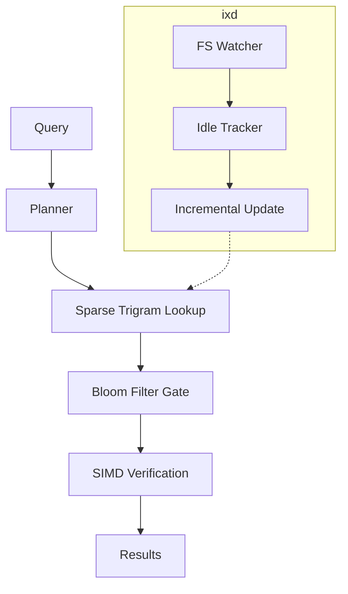

# ix 🔍

> High-performance, byte-level code search using a sparse trigram index. Optimized for humans and LLM agents.

[](LICENSE)
[](docs/CONTRIBUTING.md)
[]()

`ix` is a Unix-native code search tool that bridges the gap between linear scanners like `grep` and full-text search engines. By leveraging a **sparse trigram index**, `ix` delivers sub-millisecond search latency on multi-gigabyte codebases while maintaining a minimal disk footprint.

---

## Proof of Life

### Instant Results
```bash
$ time ix "ConnectionTimeout"
src/network/client.rs:42:1280:    pub timeout: ConnectionTimeout,
src/config/defaults.rs:15:450:    pub const DEFAULT_TIMEOUT: ConnectionTimeout = 30s;

real    0m0.004s
user    0m0.002s
sys     0m0.002s
```

### High-Signal Agent Output
```bash
$ ix --json -C 1 "xyz789"
{"file":"test3.rs","line":1,"col":0,"content":"xyz789","byte_offset":0,"context_before":[],"context_after":[]}
```

---

## Quick Start

### Installation
```bash
cargo install --path .
```

### Initializing the Index
Build the index once for your project root:
```bash
ix --build
```
*This creates a compact `.ix/shard.ix` file (typically <10% of source size).*

---

## Usage Examples

### Basic Search
```bash
ix "ConnectionTimeout"
```

### Regex Search
```bash
ix --regex "err(or|no).*timeout"
```

### Scoped Search (by file type)
```bash
ix -t rs -t py "fn main"
```

### Daemon Mode (ixd)
Keep your index fresh automatically:
```bash
ixd . &
```

---

## LLM Agent Usage
`ix` is the primary search tool for AI agents to prevent context flooding and ensure high-precision retrieval.

| Pattern | Command | Output |
|:---|:---|:---|
| **Existence Check** | `ix -c "pattern"` | Single integer (count) |
| **Location** | `ix -l "pattern"` | List of unique file paths |
| **Context** | `ix -C 3 "pattern"` | ±3 lines around matches |
| **Safe Default** | `ix "pattern"` | Max 100 results (prevents flooding) |
| **Machine Read** | `ix --json "pattern"` | JSON Lines format |

---

## Architecture



---

## Provenance & Trust

| Attribute | Value |
|:----------|:------|
| **Created By** | AI-assisted development (Gemini CLI) |
| **Human Auditor** | @moeshawky |
| **Test Coverage** | Comprehensive integration & robustness suite |
| **Security Scan** | Clean (CWE-safe trigram extraction) |
| **License** | MIT |

---

## Contributing
Contributions are welcome! Please see [CONTRIBUTING.md](docs/CONTRIBUTING.md) for details.

## License
Distributed under the MIT License. See `LICENSE` for more information.

## Acknowledgements
- Inspired by the need for faster-than-grep search in massive codebases.
- Built with Rust 2026.
