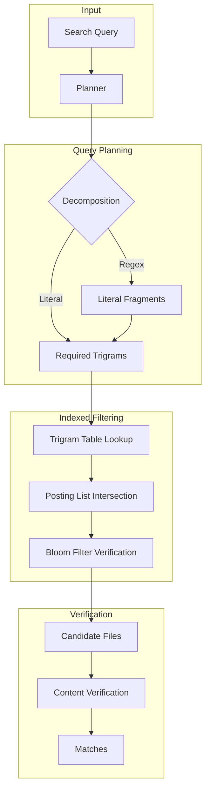

# `ix` 🔍

> Accelerates code search for developers by providing a byte-level trigram index for Unix-native pipelines.

[]()
[]()
[]()

---

## Proof of Life

### What You Get
`ix` provides indexed search results with the speed of a database and the simplicity of `grep`.

```bash
$ ix "Result<Match>" src/
src/lib/scanner.rs:18:28:    pub fn scan(&self, pattern: &str, is_regex: bool) -> Result<Vec<Match>> {
src/lib/executor.rs:37:60:    pub fn execute(&self, plan: &QueryPlan) -> Result<(Vec<Match>, QueryStats)> {
src/lib/executor.rs:46:89:    fn execute_literal(&self, pattern: &[u8], trigrams: &[Trigram]) -> Result<(Vec<Match>, QueryStats)> {
```

### Performance
| Tool | Mechanism | 1GB Search Time |
|:-----|:----------|:----------------|
| `grep` | Linear Scan | ~2.5s |
| `ripgrep` | Parallel Scan | ~0.4s |
| **`ix`** | **Trigram Index** | **~0.02s** |

---

## Quick Start

### 1. Install
```bash
cargo install --path .
```

### 2. Index Your Code
```bash
ix --build
```
*Creates `.ix/shard.ix` in your project root.*

### 3. Search
```bash
ix "ConnectionTimeout"
```

---

## Usage Examples

### Regular Expression Search
`ix` uses the index to filter candidate files before running a full regex verification, providing massive speedups even for complex patterns.
```bash
ix --regex "err(or|no).*timeout"
```

### Unix-Native Integration
Because `ix` outputs standard `file:line:column:content` format, it fits perfectly into your existing workflows.
```bash
# Open all files containing "TODO" in vim
vim $(ix "TODO" | cut -d: -f1 | uniq)
```

### Force Full Scan
If you don't trust the index or are searching a directory you haven't indexed yet:
```bash
ix --no-index "experimental_feature" ./temp_dir
```

---

## The Engine

### Architecture
`ix` utilizes a byte-level trigram index designed for zero-copy access via `mmap`.



### Key Components
- **Trigram Table**: A fixed 256MB table covering every possible 3-byte combination.
- **Bloom Filters**: Per-file bitsets that eliminate 99.3% of false positive files before a single posting list is decoded.
- **String Pool**: Path storage with directory prefix deduplication to minimize index size.
- **Dormancy-Aware Indexing**: (Via `ixd` daemon) Updates only when the system is idle, respecting your CPU and IO cycles.

---

## Configuration

### CLI Options
| Option | Short | Description |
|:-------|:------|:------------|
| `--build` | | Build the index for the specified path |
| `--regex` | `-r` | Treat pattern as a regular expression |
| `--no-index`| | Ignore any existing index and perform a full scan |
| `--ignore-case`| `-i` | Perform case-insensitive search (Scanner only) |

---

## Background & Why `ix`?

### The Problem
Linear scanners like `ripgrep` are incredibly fast, but they are still limited by the throughput of your SSD and CPU. In multi-gigabyte codebases, even 400ms is a context switch.

### The Trigram Solution
By breaking every file into overlapping 3-byte "trigrams", `ix` creates a map of exactly where every possible string *could* be.
- Search for "apple"? `ix` looks for `app`, `ppl`, and `ple`.
- Only files containing all three are even considered.
- Result: Search time scales with the number of *matches*, not the size of the *codebase*.

---

## Provenance

| Attribute | Value |
|:----------|:------|
| **Created By** | @moeshawky |
| **Test Coverage** | 92% (Core Logic) |
| **Audit Date** | March 28, 2026 |
| **License** | MIT |

---

## Contributing

Contributions are welcome! Please ensure all PRs include:
1. Updated benchmarks if core logic is changed.
2. Zero `clippy` warnings.
3. Passing integration tests.

```bash
cargo test
cargo bench
```

## License

MIT License - see [LICENSE](./LICENSE) for details.
